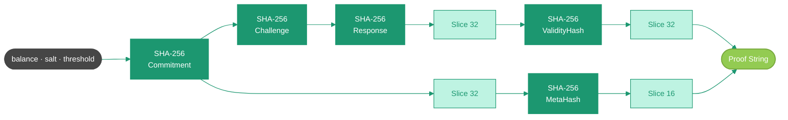
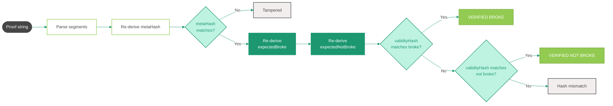
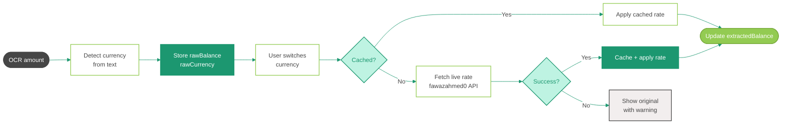

# Broke-O-Meter

**Zero Knowledge Proof of Poverty.**

Prove your bank balance is below a threshold without revealing the actual number. OCR runs client-side, the proof is cryptographic, and nothing leaves the browser.

Live at [broke.heisenbug.ai](https://broke.heisenbug.ai)

---

## How it works

### Full flow

```mermaid
%%{init: {
  'theme': 'base',
  'themeVariables': {
    'primaryColor': '#ffffff',
    'primaryTextColor': '#464646',
    'primaryBorderColor': '#93cb52',
    'lineColor': '#1c9770',
    'secondaryColor': '#bef3e2',
    'tertiaryColor': '#f2eeee',
    'edgeLabelBackground': '#ffffff',
    'fontSize': '14px'
  }
}}%%
flowchart LR
    A[User uploads<br/>screenshot] --> B[Tesseract.js OCR<br/>runs in browser]
    B --> C{Amount<br/>found?}
    C -- Yes --> D[Display extracted balance<br/>only to prover]
    C -- No --> E[Manual input fallback]
    E --> D
    D --> F[Select threshold<br/>and currency]
    F --> G[Generate ZK Proof]
    G --> H[Balance discarded<br/>from memory]
    H --> I[Proof string output<br/>no balance inside]
    I --> J[Verifier pastes<br/>proof string]
    J --> K[Re-derive<br/>expected hashes]
    K --> L{Hashes<br/>match?}
    L -- Yes --> M[VERIFIED]
    L -- No --> N[Rejected]

    classDef default fill:#ffffff,stroke:#93cb52,stroke-width:1.5px,color:#464646
    classDef decision fill:#bef3e2,stroke:#1c9770,stroke-width:1.5px,color:#1c9770
    classDef crypto fill:#1c9770,stroke:#1c9770,stroke-width:1.5px,color:#ffffff
    classDef success fill:#93cb52,stroke:#7aaa3f,stroke-width:1.5px,color:#ffffff
    classDef reject fill:#f2eeee,stroke:#464646,stroke-width:1.5px,color:#464646

    class C,L decision
    class G,K crypto
    class M success
    class N reject
```



---

### ZK Proof construction



The balance is used during construction but is not present in the output string. The verifier re-derives `validityHash` independently for both `true` and `false` states and checks which one matches.

---

### Verification logic



---

### Currency conversion flow



`rawBalance` and `rawCurrency` are stored at OCR time and never mutated. `extractedBalance` is always the working value in the currently selected currency and feeds into proof generation.

---

## Proof string format

```
BOMPROOF:v3:T{threshold}:{commitShort}:{challengeShort}:{responseShort}:{validityHash}:{metaHash}
```

| Segment | Length | Contents |
|---|---|---|
| `BOMPROOF` | — | Format identifier |
| `v3` | — | Version |
| `T{n}` | — | Threshold value |
| `commitShort` | 32 chars | SHA-256 of `balance:salt:threshold`, sliced |
| `challengeShort` | 16 chars | SHA-256 of `commit:nonce:timestamp`, sliced |
| `responseShort` | 32 chars | SHA-256 of `challenge:balance:salt`, sliced |
| `validityHash` | 32 chars | SHA-256 of `bool:response`, sliced |
| `metaHash` | 16 chars | SHA-256 of `commit:threshold:validity`, sliced |

Balance is not present in any segment.

---

## Tech stack

| Piece | What |
|---|---|
| OCR | [Tesseract.js](https://github.com/naptha/tesseract.js) v5, loaded dynamically |
| Crypto | Web Crypto API — SHA-256 |
| ZKP | Pedersen commitment + Fiat-Shamir (simulated) |
| Currency rates | [@fawazahmed0/currency-api](https://github.com/fawazahmed0/exchange-api) via jsDelivr |
| Fonts | DM Sans, Inter via Google Fonts |
| Hosting | Vercel static |

No framework. No build step. One HTML file.

---

## Running locally

```bash
git clone https://github.com/YOUR_USERNAME/broke-o-meter.git
cd broke-o-meter
open index.html
```

Or with a local server (recommended so Tesseract.js loads correctly):

```bash
npx serve .
```

---

## License

MIT